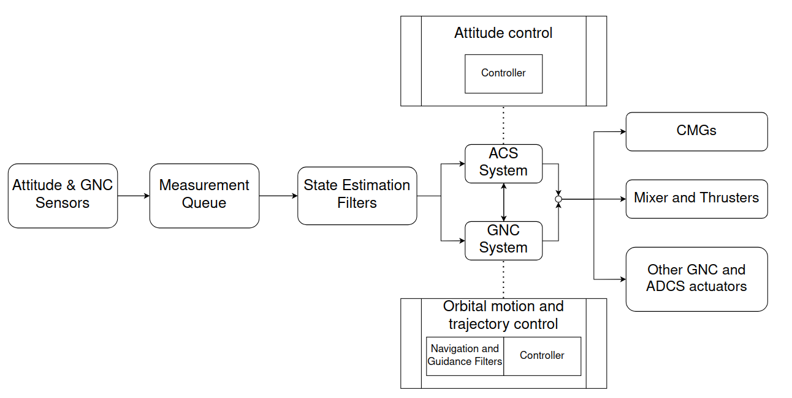

# Attitude and Orbit Control System (AOCS) for Space Station OS: System Model, Controls & Filters

This repository contains the development of the Attitude and Orbit Control System (AOCS) for the Space Station OS subsystem. The work focuses on designing and simulating foundational components of the AOCS, ensuring precise control of the space station's attitude and orbital dynamics.

This repository is extension to these Repos:
- [Motion Dynamics](https://github.com/space-station-os/demo_motion_dynamics)

Final AOCS system will include:

1. Full Dynamics of AOCS system (Attitude and Orbital)
2. Control system for CMGs and Thrusters (Linear, Non-Linear and Optimal)
3. Filter & Sensor Fusion (Kalman Filter, Extended Kalman Filter & Unscented Kalman Filter)
4. Probably addition of dynamics due to docking.

## AOCS Architecture

- ADCS: Attitude Determination and Control System
- GNC: Guided, Navigation & Control

## Objectives
1. **System Modeling**: Develop mathematical models of the space station's 6DOF rotational and translational dynamics, accounting for external forces and environmental factors.
2. **Control System Design**: Implement stabilization and tracking non-linear optimal controllers
3. **State Estimation and Sensor Fusion**: Integrate sensor inputs using the Unscented Kalman Filter (UKF) for accurate state estimation.

## Current Focus
- Building body dynamics models using Newton-Euler equations.
  - Rotational dynamics with quaternions/DCM to avoid singularities.
  - Translational dynamics incorporating forces like gravity gradients and solar radiation pressure.
- Designing linear and non-linear controllers for attitude stabilization and tracking.
- Prioritizing system modeling as the foundation for further development.

## Build and Run
```bash
mkdir build && cd build
cmake ..
make
./iss_aocs

# To vusulaise the dynamics
cd ..
python scripts/vis_data.py
```

### Single-Gimballed CMG Model

## Model with constant Torque input and untuned linear PD controller from Single Gimballed CMGs


### More details regarding equations:
[Resources and Equations](resources/)

### Consideration
- Considered a static inertial frame
- Considered a constant atmospheric model that don't change dynamically and have constant pressure and density
- All the torques and dynamics are modelled wrt to body frame and LVLH frame (wherever required)
  
### TODO:
- Add more perturbation like aerodynamic torque, magnetic torque, gaussian-noise, etc
- Shift to ROS2 and visualise the output live as the solver solves the equations
- Consider a more complex body shape and inertia parameters
- Add a NMPC controller to adjust the attitude with CMGs and later on with thrusters
- Add rotational inertial frame
- Calculate root-locus and bode-plot to design compensator and tune PID controller

## Future Work
Subsequent phases will expand on nonlinear and adaptive control strategies, fault-tolerant mechanisms, and advanced functionalities aligned with real-world space station requirements. We'll also probably design a **reinforcement learning** approach for steering of variable Speed CMGs.
